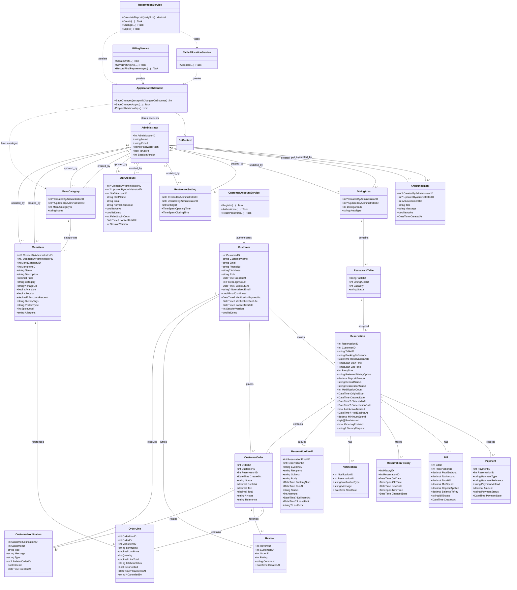

# Implementation class diagram

```mermaid
classDiagram
    direction TB
    class Administrator {
        +int AdministratorID
        +string Name
        +string Email
        +string PasswordHash
        +bool IsActive
        +int SessionVersion
    }
    class Announcement {
        +int? CreatedByAdministratorID
        +int? UpdatedByAdministratorID
        +int AnnouncementID
        +string Title
        +string Message
        +bool IsActive
        +DateTime CreatedAt
    }
    class Bill {
        +int BillID
        +int ReservationID
        +decimal FoodSubtotal
        +decimal TaxAmount
        +decimal TotalBill
        +decimal MinSpend
        +decimal DepositApplied
        +decimal BalanceToPay
        +string BillStatus
        +DateTime CreatedAt
    }
    class Customer {
        +int CustomerID
        +string CustomerName
        +string Email
        +string PhoneNo
        +string? Address
        +string Role
        +DateTime CreatedAt
        +int FailedLoginCount
        +DateTime? LockoutEnd
        +string? NormalizedEmail
        +bool EmailConfirmed
        +DateTime? VerificationExpiresUtc
        +DateTime? VerificationSentUtc
        +DateTime? LockedUntilUtc
        +int SessionVersion
        +bool IsDemo
    }
    class CustomerNotification {
        +int CustomerNotificationID
        +int CustomerID
        +string Title
        +string Message
        +string Type
        +int? RelatedOrderID
        +bool IsRead
        +DateTime CreatedAt
    }
    class CustomerOrder {
        +int OrderID
        +int CustomerID
        +int ReservationID
        +DateTime CreatedAt
        +string Status
        +decimal Subtotal
        +decimal Tax
        +decimal Total
        +string? Notes
        +string Reference
    }
    class OrderLine {
        +int OrderLineID
        +int OrderID
        +int MenuItemID
        +string ItemName
        +decimal UnitPrice
        +int Quantity
        +decimal LineTotal
        +string KitchenStatus
        +bool IsCancelled
        +DateTime? CancelledAt
        +string? CancelledBy
    }
    class DiningArea {
        +int? CreatedByAdministratorID
        +int? UpdatedByAdministratorID
        +int DiningAreaID
        +string AreaType
    }
    class MenuCategory {
        +int? CreatedByAdministratorID
        +int? UpdatedByAdministratorID
        +int MenuCategoryID
        +string Name
    }
    class MenuItem {
        +int? CreatedByAdministratorID
        +int? UpdatedByAdministratorID
        +int MenuCategoryID
        +int MenuItemID
        +string Name
        +string Description
        +decimal Price
        +string Category
        +string? ImageUrl
        +bool IsAvailable
        +bool IsPopular
        +decimal? DiscountPercent
        +string DietaryTags
        +string ProteinType
        +int SpiceLevel
        +string Allergens
    }
    class Notification {
        +int NotificationID
        +int ReservationID
        +string NotificationType
        +string Message
        +DateTime SentDate
    }
    class Payment {
        +int PaymentID
        +int ReservationID
        +string PaymentType
        +string PaymentReference
        +string PaymentMethod
        +decimal Amount
        +string PaymentStatus
        +DateTime PaymentDate
    }
    class Reservation {
        +int ReservationID
        +int CustomerID
        +string TableID
        +string BookingReference
        +DateTime ReservationDate
        +TimeSpan StartTime
        +TimeSpan EndTime
        +int PartySize
        +string PreferredDiningOption
        +decimal DepositAmount
        +string DepositStatus
        +string ReservationStatus
        +int ModificationCount
        +DateTime OriginalStart
        +DateTime CreatedDate
        +DateTime? CheckedInAt
        +DateTime? CancellationDate
        +bool LateArrivalNotified
        +DateTime? HoldExpiresAt
        +decimal MinimumSpend
        +byte[] RowVersion
        +bool OrderingEnabled
        +string? DietaryRequest
    }
    class ReservationEmail {
        +int ReservationEmailID
        +int ReservationID
        +string EventKey
        +string Recipient
        +string Subject
        +string Body
        +DateTime BookingStart
        +DateTime DueAt
        +string Status
        +int Attempts
        +DateTime? DeliveredAt
        +DateTime? LeaseUntil
        +string? LastError
    }
    class ReservationHistory {
        +int HistoryID
        +int ReservationID
        +DateTime OldDate
        +TimeSpan OldTime
        +DateTime NewDate
        +TimeSpan NewTime
        +DateTime ChangedDate
    }
    class RestaurantSetting {
        +int? CreatedByAdministratorID
        +int? UpdatedByAdministratorID
        +int SettingID
        +TimeSpan OpeningTime
        +TimeSpan ClosingTime
    }
    class RestaurantTable {
        +string TableID
        +int DiningAreaID
        +int Capacity
        +string Status
    }
    class Review {
        +int ReviewID
        +int CustomerID
        +int OrderID
        +int Rating
        +string Comment
        +DateTime CreatedAt
    }
    class StaffAccount {
        +int? CreatedByAdministratorID
        +int? UpdatedByAdministratorID
        +int StaffAccountID
        +string StaffName
        +string Email
        +string NormalizedEmail
        +bool IsActive
        +bool IsDemo
        +int FailedLoginCount
        +DateTime? LockedUntilUtc
        +int SessionVersion
    }
    Customer "1" -- "0..*" Reservation : makes
    DiningArea "1" -- "0..*" RestaurantTable : contains
    RestaurantTable "1" -- "0..*" Reservation : assigned
    Reservation "1" -- "0..*" Payment : records
    Reservation "1" -- "0..1" Bill : has
    Reservation "1" -- "0..*" ReservationHistory : tracks
    Reservation "1" -- "0..*" Notification : has
    Reservation "1" -- "0..*" ReservationEmail : queues
    Customer "1" -- "0..*" CustomerOrder : places
    Reservation "1" -- "0..*" CustomerOrder : contains
    CustomerOrder "1" -- "0..*" OrderLine : contains
    MenuItem "1" -- "0..*" OrderLine : referenced
    Customer "1" -- "0..*" Review : writes
    CustomerOrder "1" -- "0..*" Review : receives
    Customer "1" -- "0..*" CustomerNotification : receives
    CustomerOrder "0..1" -- "0..*" CustomerNotification : relates
    MenuCategory "1" -- "0..*" MenuItem : categorises
    Administrator "0..1" -- "0..*" Announcement : created_by
    Administrator "0..1" -- "0..*" Announcement : updated_by
    Administrator "0..1" -- "0..*" DiningArea : created_by
    Administrator "0..1" -- "0..*" DiningArea : updated_by
    Administrator "0..1" -- "0..*" RestaurantSetting : created_by
    Administrator "0..1" -- "0..*" RestaurantSetting : updated_by
    Administrator "0..1" -- "0..*" StaffAccount : created_by
    Administrator "0..1" -- "0..*" StaffAccount : updated_by
    Administrator "0..1" -- "0..*" MenuCategory : created_by
    Administrator "0..1" -- "0..*" MenuCategory : updated_by
    Administrator "0..1" -- "0..*" MenuItem : created_by
    Administrator "0..1" -- "0..*" MenuItem : updated_by
    class ReservationService {
        +CalculateDeposit(partySize) decimal
        +Create(...) Task
        +Change(...) Task
        +Expire() Task
    }
    class TableAllocationService {
        +Available(...) Task
    }
    class BillingService {
        +CreateDraft(...) Bill
        +SaveDraftAsync(...) Task
        +RecordFinalPaymentAsync(...) Task
    }
    class CustomerAccountService {
        +Register(...) Task
        +Authenticate(...) Task
        +ResetPassword(...) Task
    }
    class ApplicationDbContext {
        +SaveChanges(acceptAllChangesOnSuccess) int
        +SaveChangesAsync(...) Task
        -PrepareRelationships() void
    }
    ApplicationDbContext --|> DbContext
    ReservationService ..> TableAllocationService : uses
    ReservationService ..> ApplicationDbContext : persists
    TableAllocationService ..> ApplicationDbContext : queries
    BillingService ..> ApplicationDbContext : persists
    CustomerAccountService ..> Customer : authenticates
    ApplicationDbContext ..> Administrator : stores accounts
    ApplicationDbContext ..> MenuCategory : links catalogue
```
